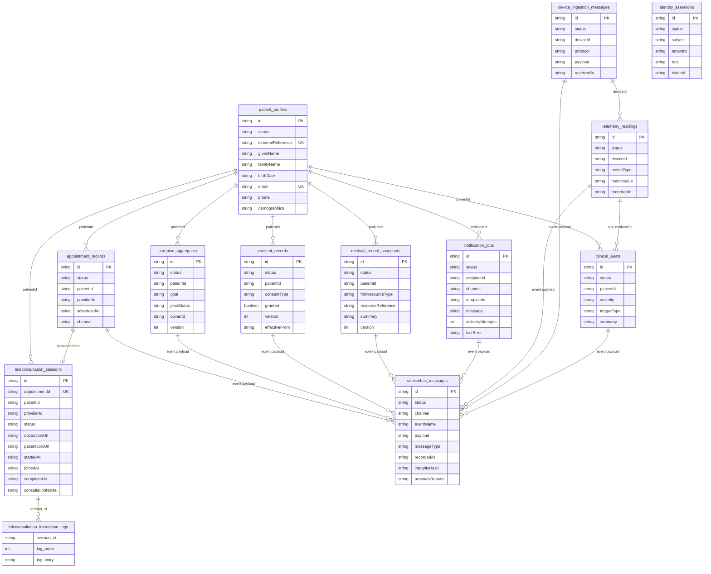

# ERD Alignment: Logical Model vs Physical Tables

## Decision

Yes, the ER documentation should be updated.

The existing ER diagram in [ER_Diagram_HealthCare.png](ER_Diagram_HealthCare.png) is still useful as a logical domain model, but it no longer matches current physical persistence names introduced in JPA migrations.

## Why This Mismatch Exists

The ER diagram uses domain-oriented names (for example, PATIENT, CONSENT, CARE_PLAN_CONTROL).

The code now persists service-local aggregate snapshots with implementation-oriented table names.

This is expected in a microservice architecture, but it should be documented explicitly to avoid review confusion.

## Current Physical Tables Implemented in Code

| Service | Entity Class | Physical Table |
|---|---|---|
| patient | PatientProfileEntity | patient_profiles |
| appointment | AppointmentRecordEntity | appointment_records |
| careplan | CarePlanAggregateEntity | careplan_aggregates |
| consent | ConsentRecordEntity | consent_records |
| medical-record | MedicalRecordSnapshotEntity | medical_record_snapshots |
| notification | NotificationJobEntity | notification_jobs |
| telemetry | TelemetryReadingEntity | telemetry_readings |
| device-ingestion | DeviceMessageEntity | device_ingestion_messages |
| alert-management | ClinicalAlertEntity | clinical_alerts |
| identity-adapter | IdentityAssertionEntity | identity_assertions |
| event-messaging | ServiceBusMessageEntity | servicebus_messages |

## Logical-to-Physical Mapping (Current State)

| Logical ERD Name | Physical Table (if implemented) | Notes |
|---|---|---|
| PATIENT | patient_profiles | Naming differs, same core concept.
| CARE_PLAN_CONTROL | careplan_aggregates | Aggregate state table, not full relational decomposition.
| CONSENT | consent_records | Naming differs, concept aligned.
| NOTIFICATION | notification_jobs | Naming differs, concept aligned.
| CARE_ACTIVITY | not implemented as JPA table in current code | Exists in logical model.
| PROTOCOL | not implemented as JPA table in current code | Exists in logical model.
| AUDIT_EVENT | not implemented as JPA table in current code | Audit is currently modeled elsewhere, not as this table.
| APPOINTMENT | appointment_records | Additional persisted table not shown in current ERD image.
| MEDICAL_RECORD | medical_record_snapshots | Additional persisted table not shown in current ERD image.
| TELEMETRY | telemetry_readings | Additional persisted table not shown in current ERD image.
| DEVICE_INGESTION | device_ingestion_messages | Additional persisted table not shown in current ERD image.
| ALERT_MANAGEMENT | clinical_alerts | Additional persisted table not shown in current ERD image.
| IDENTITY_ADAPTER | identity_assertions | Additional persisted table not shown in current ERD image.
| EVENT_MESSAGING | servicebus_messages | Additional persisted table not shown in current ERD image.

## Relationship Modeling Note

Current JPA entities do not declare ORM foreign-key relationships using @ManyToOne/@OneToMany annotations. This matches the architecture principle of service-local ownership and avoiding cross-service relational coupling.

## Recommended ERD Update

1. Keep the current diagram and relabel it as Logical ERD.
2. Add a second diagram named Physical Persistence Model (As Implemented).
3. Include this mapping table in design docs so reviewers can trace logical names to actual tables.
4. Add appointment_records, medical_record_snapshots, telemetry_readings, device_ingestion_messages, clinical_alerts, identity_assertions, and servicebus_messages to the physical diagram.

## Impact on Review/Compliance

- No architectural issue is implied by name differences alone.
- A documentation update is required for traceability and auditability.
- Remaining service migrations in the initial P0-2 list are now completed.

## Physical Persistence Model (Mermaid)

The diagram below is an as-implemented physical persistence view for currently migrated services, including UC-10 audit metadata.

Notes:

- Relationships shown are semantic links via identifiers and event payloads.
- Cross-service links are intentionally not enforced as ORM foreign keys.
- UC-10 additions are modeled in servicebus_messages via recordedAt, integrityHash, and anomalyReason.
